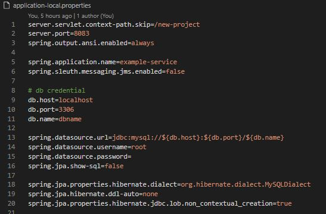
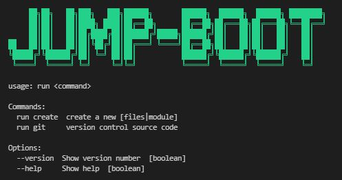
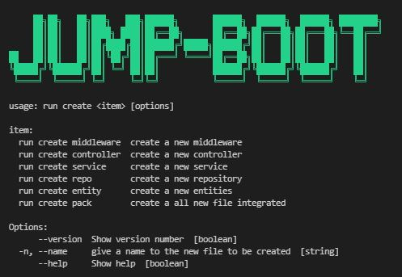
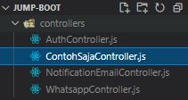
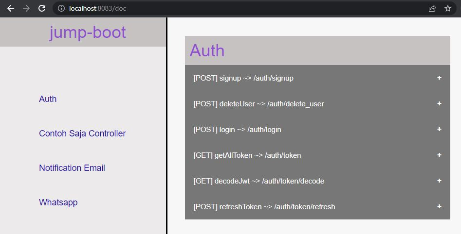
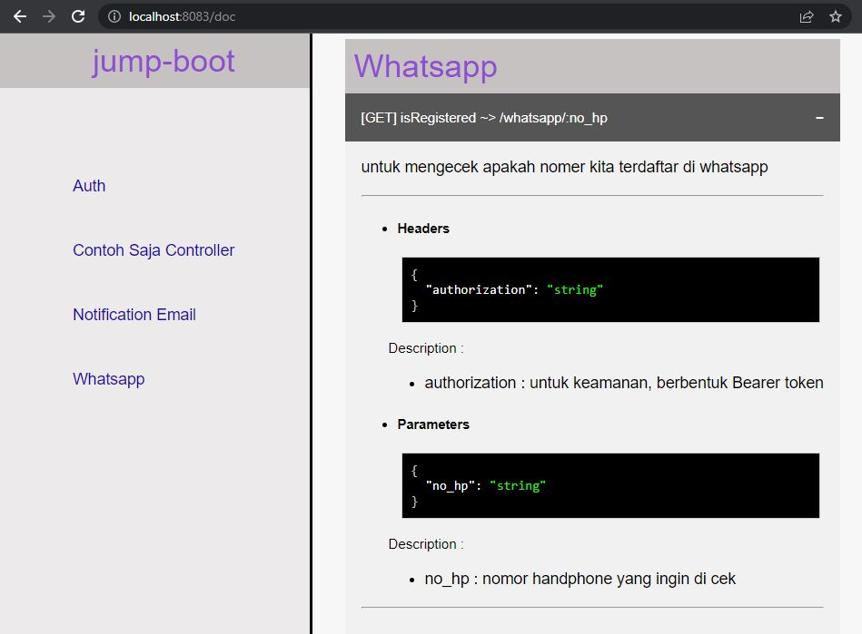
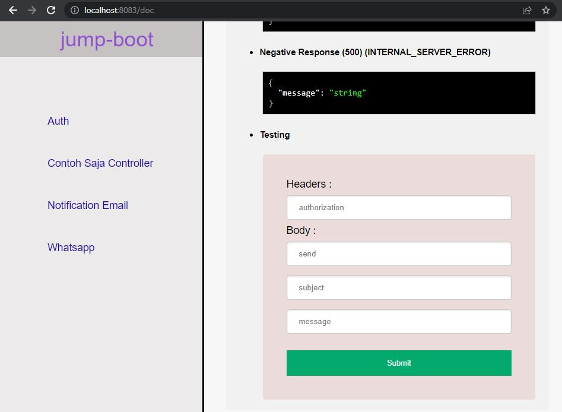
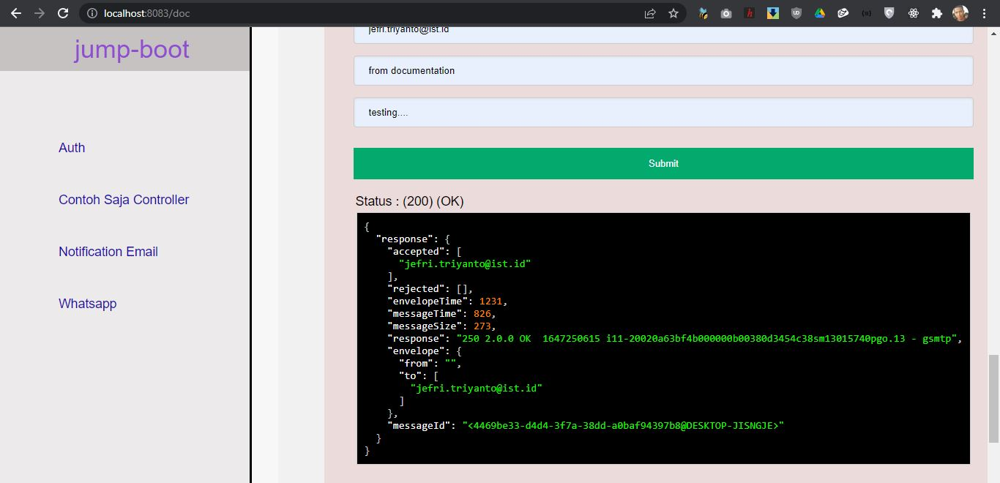

---

[](https://www.youtube.com/user/jefripunza/videos/)
[](https://www.youtube.com/user/jefripunza/videos/)
[](https://www.youtube.com/user/jefripunza/videos/)

## Donate

[](https://www.paypal.com/paypalme/jefripunza)

## Social Media

[](https://www.youtube.com/user/jefripunza/)
[](https://www.instagram.com/jefripunza/)
[](https://fb.com/jefripunza/)
[](https://twitter.com/jefripunza/)
[](https://www.linkedin.com/in/jefri-herdi-triyanto-ba76a8106/)
[](https://jefriherditriyanto.com/)

## Technology

[](https://nodejs.dev/learn/introduction-to-nodejs)
[](https://expressjs.com/)
[](https://jwt.io/)

[](https://www.mongodb.com/)
[](https://www.mysql.com/)
[](https://mariadb.org/)
[](https://www.postgresql.org/)
[](https://www.sqlite.org/)
[](https://www.cockroachlabs.com/)
[](https://docs.microsoft.com/en-us/sql/sql-server/?view=sql-server-ver15)

[](https://reactjs.org/)
[](https://vuejs.org/)
[](https://angular.io/)
[](https://svelte.dev/)
[](https://www.gatsbyjs.com/)
[](https://nextjs.org/)
[](https://nuxtjs.org/)
[](https://aurelia.io/)
[](https://jasmine.github.io/)
[](https://www.meteor.com/)
[](https://quasar.dev/)

[](https://www.w3schools.com/html/)
[](https://www.w3schools.com/css/)
[](https://www.javascript.com/)

[](https://mochajs.org/)

## Introduction

Konsep dasar framework ini adalah mengacu kepada struktur dari **[Java Spring-Boot](https://spring.io/projects/spring-boot)** yang mana semua file project berbentuk OOP dan struktur nya **hampir mirip** dengan **Java Spring-Boot**. Saya sengaja membuat ini supaya teman2 yang dari Java Spring-Boot yang ingin **Hijrah** ke NodeJS maka menggunakan ini akan sangat familiar.


Ditambah dengan metode frontend development yang saya buat sendiri dengan nama **Remote Frontend Package (RFP)**, yaitu dengan mengarsipkan semua hasil build dan file archive-nya (zip) dikirim ke pihak backend agar isi file archive di ekstrak ke dalam folder **js-framework** untuk ditampilkan ke publik.

Melihat dari beberapa kelebihan dari Jump-Boot dan metode RFP yang saya buat, maka saya membuat repositori ini agar saya dan kawan-kawan bisa merasakan bagaimana menggunakan framework ini di NodeJS.
Mudah-mudahan bermanfaat...

---

<br />

## First Prepare

dikarenakan saya menggunakan **NodeJS**, maka yang harus dipersiapkan terlebih dahulu adalah :
| Aplikasi | Kegunaan | Link |
|----------|----------|------|
| NodeJS | lingkungan javascript untuk running JS diluar browser | [download & install](https://nodejs.org/en/) |
| Yarn | package manager yang lebih mudah digunakan daripada **NPM** | [doc](https://yarnpkg.com/getting-started/usage) |
| PM2 | process manager untuk running microservices | [doc](https://pm2.keymetrics.io/docs/usage/quick-start/) |
| Nodemon | auto reload service jika project di save (for development only) | [doc](https://www.npmjs.com/package/nodemon) |
| ExpressJS | framework web app untuk **NodeJS** yang ditulis dengan bahasa pemrograman JavaScript | [doc](https://expressjs.com/en/starter/basic-routing.html) |
| JSON Web Token | salah satu keamanan akses di NodeJS | [doc](https://jwt.io/) |
| TypeORM | sebagai penghubung dan mempermudah membuat aplikasi menggunakan database berbasis rasional | [doc](https://typeorm.io/#/connection-options/common-connection-options) |
| Socket.io | (if use) teknologi protokol websocket untuk data realtime | [doc](https://socket.io/docs/v4/) |
| Node Mailer | (if use) pengiriman email menggunakan NodeJS | [doc](https://nodemailer.com/about/) |
| WhatsApp API (socket) | (if use) menggunakan service whatsapp didalam NodeJS | [doc](https://github.com/adiwajshing/baileys) |

### Global Setup (hanya sekali saja dalam 1 perangkat)

untuk menginisial kebutuhan dalam running dan developing

```bash
npm install -g yarn pm2 nodemon
```

### Clone Template

```bash
git clone https://github.com/jefripunza/jump-boot my-project-name

// or

git clone https://github.com/jefripunza/jump-boot .
```

### Install Dependencies

```bash
npm install

// or

yarn install
```

### setup .env

rename **.env-example** menjadi file **.env**, kemudian rubah sesuai kebutuhan/require :

```text
MAILER_EMAIL_LOCAL=
MAILER_PASS_LOCAL=

MAILER_EMAIL_DEV=
MAILER_PASS_DEV=

MAILER_EMAIL_PRODUCTION=
MAILER_PASS_PRODUCTION=
```

NOTE : jika anda menggunakan Node Mailer, maka setup diatas adalah **WAJIB**. jika tidak? abaikan saja setup ini.

### setup .properties

karena framework ini terinspirasi dari **Java Spring-Boot**, maka setup nya pun sama dengan framework tersebut. dengan alasan jika ingin migrasi tinggal copas saja settingan dari **Java Spring-Boot** kedalam project ini maka sudah otomatis terkonfigurasi.

contoh isi file .properties seperti ini :


### run app

untuk menjalankan project ini, seperti berikut :
```bash
node .     // standard

// or

nodemon    // development

// or

pm2 start ./jump-boot/start.js --name your-service-name    // untuk microservice menggunakan pm2
```

<br />

---

<br />

## CLI App

cara menggunakan CLI App, simak berikut ini :

pastikan file **run.js** ada di project ini, lalu ketik seperti ini di terminal :
```bash
node run
```

maka akan muncul seperti ini :


untuk melihat menu file project dasar apa saja yang bisa di create secara otomatis dengan mengetik seperti ini di terminal :
```bash
node run create
```

maka akan muncul seperti ini :


kemudian jika ingin membuat file project dasar secara otomatis dengan mengetik seperti ini di terminal (example) :
```bash
node run create controller   // auto generate dengan nama "ExampleController.js"

// or

node run create controller --name contohSaja   // untuk custom nama file beserta endpoint dan nama class nya
```

maka akan muncul seperti ini (example) :


akan terbuat otomatis file seperti ini (example) :


dan hasilnya akan seperti ini (example) :


NOTE : untuk isi file yang baru terbuat akan ter-include beberapa endpoint standar seperti **GetMapping, PostMapping, PutMapping, dan DeleteMapping** beserta anotasi2 standar

<br />

---

<br />

## Remote Frontend Package (RFP)

untuk mengaktifkan **RFP**, anda perlu menambahkan di setup server didalam file **Main.js** :
```javascript
class Main {

    rfp = true

}
```

kemudian copy file **[sendToBackend.js](https://github.com/jefripunza/jump-boot/blob/main/jump-boot/rfp/sendToBackend.js)** kemudian paste-kan **kedalam root project frontend anda** dengan nama **sendToBackend.js** dan **install dependency** yang diperlukan didalam project frontend dengan cara:

#### frontend development side

```bash
npm -i -D form-data archiver && npm i axios

// or

yarn add -D form-data archiver && yarn add axios
```

rubah **package.json** pada bagian build menjadi :

```json
// (default) build folder is "build"
{
    ...
    "scripts": {
        "build": "react-scripts build && node sendToBackend"
    },
    ...
}

// build folder is "dist"
{
    ...
    "scripts": {
        "build": "react-scripts build && node sendToBackend dist"
    },
    ...
}

// and so on, following your basic javascript framework build folder
```

NOTE : khusus untuk frontend, rubah password yang ada didalam file **sendToBackend.js** dengan password RFP dari Backend yang tergenerate otomatis ketika project ini di running.

<br />

---

<br />

## How to Development

perhatikan dengan seksama cara menggunakan framework ini :

### setup server (Main.js)
```javascript
class Main {

    server = {
        debug: true, // show endpoint if hit
        database: true, // use database
        doc: true, // like Swagger (#your_root#/doc)
        public_directory: true,
        maxUploadSize: 20, // MB
        // security
        cors: true,
        helmet: true,
        jwt: true,
    }

}
```

### setup mailer (Main.js)
```javascript
class Main {

    mailer = process.env.application === 'production' ?
        {
            host: 'smtp.ethereal.email',
            port: 587,
            secure: false, // true for 465, false for other ports
            auth: {
                user: process.env.MAILER_EMAIL_PRODUCTION,
                pass: process.env.MAILER_PASS_PRODUCTION,
            },
        } :
        process.env.application === 'dev' ?
            {
                host: 'smtp.ethereal.email',
                port: 587,
                secure: false, // true for 465, false for other ports
                auth: {
                    user: process.env.MAILER_EMAIL_DEV,
                    pass: process.env.MAILER_PASS_DEV,
                },
            } :
            {
                // local (default)
                service: 'gmail',
                auth: {
                    user: process.env.MAILER_EMAIL_LOCAL,
                    pass: process.env.MAILER_PASS_LOCAL,
                },
            };

}
```

### setup whatsapp (Main.js)
```javascript
class Main {

    whatsapp = {
        name: 'My Project Name',
    }

}
```

NOTE : jika anda pertama kali menggunakan whatsapp, anda harus merubah tipe whatsapp anda menjadi **multi device** pada pengaturan aplikasi handphone :
```text
- Android

Buka WhatsApp, pilih More Options.
Ketuk Linked Devices.
Ketuk Multi-Device Beta.
Ketuk Join Beta.

// atau

- iPhone

Pilih WhatsApp Settings.
Ketuk Linked Devices.
Ketuk Multi-Device Beta, ketuk Join Beta.
```
kemudian jalankan sejenak project ini untuk __mengeluarkan barcode__, kemudian **scan barcode yang muncul di terminal**. akan ada file baru bernama **whatsapp-session.json** untuk menyimpan session login whatsapp anda.


### setup JWT (Main.js ~> server)
jika anda menggunakan JWT, anda perlu mengaktifkan didalam configurasi server dengan cara :

```javascript
class Main {

    server = {
        jwt: true, // untuk mengenerate otomatis secret token didalam file .env

        // or

        jwt: 20, // panjang dari secret token yang akan di generate
    }

}
```

lalu untuk membuat token baru saat login, seperti ini untuk controller nya (example) :
```javascript
class AuthController {

  /**
   * @PostMapping ("/login")
   * @ValidateBody ({ username: "string", password: "string" })
   */
    login = async (req, res) => {
        const { username, password } = req.body;
        try {
            const isLogin = await this.LoginService.loginGetToken(username, password)
            if (isLogin) {
                super.sendSuccessJson(res, {
                    ...isLogin,
                });
            } else {
                super.sendClientErrorJson(res, 'maaf, username atau password salah')
            }
        } catch (error) {
            super.sendServerErrorJson(res, error.message);
        }
    };

}
```

lalu pada service nya seperti ini :
```javascript
class LoginService {

    loginGetToken = async (username, password) => {
        const result = await this.LoginRepository.fromUserWhereUsernameAndPassword(username, password)
        if (result) {
            // update last_login
            await this.LoginRepository.updateFromUserWhereId(result.id)
            return this.jwt.createTokenLogin( // ini cara mendapatkan token dan refresh token
                result, // data yang akan di jadikan token
                this.jwt.valueOneHour, // expired untuk token utama
                this.jwt.valueOneDay, // expired untuk refresh token
            );
        }
        return false
    }

}
```

dan setelah itu cara mengamankan endpoint, tulis anotasi seperti ini :
```javascript
class Controller {

  /**
   * @GetMapping ("/")
   * @Jwt
   */
    isRegistered = async (req, res) => {
        // code
    }

}
```

### setup auto documentation (like Swagger)
jika anda menggunakan auto documentation, silahkan simak berikut ini :

aktifkan terlebih dahulu didalam configurasi server dengan cara :
```javascript
class Main {

    server = {
        doc: true,
    }

}
```

kemudian didalam setiap **Endpoint** didalam file **Controller** menggunakan anotasi seperti ini (example) :
```javascript
class Controller {

  /**
   * @GetMapping ("/")
   * // for documentation (includes unit test)
   * @Doc ("untuk mengecek apakah nomer kita terdaftar di whatsapp")
   * @DocHeaders     ({ authorization:"string" })
   * @DocHeadersDesc ({ authorization:"untuk keamanan, berbentuk Bearer token" })
   * @DocParams     ({ no_hp:"string" })
   * @DocParamsDesc ({ no_hp:"nomor handphone yang ingin di cek" })
   * @Doc200 ({"no_hp":"string","registered":"boolean"})
   * @Doc400 ({ message:"string" })
   */
    isRegistered = async (req, res) => {
        ...
    }

}
```

maka akan muncul seperti ini di endpoint "http://localhost:#port/#root/doc" (example) :







<br />

---

<br />

## Support the project

Apakah kamu menyukai project ini? Please support saya dengan menekan subscribe di [Youtube Channel](https://www.youtube.com/user/jefripunza/videos/) saya...

<br />

## Donation Please

Butuh ngopi gans, kasih lah untuk biaya pengembangan agar mudah membeli alat dan buat makan <br />
[](https://www.paypal.com/paypalme/jefripunza)
